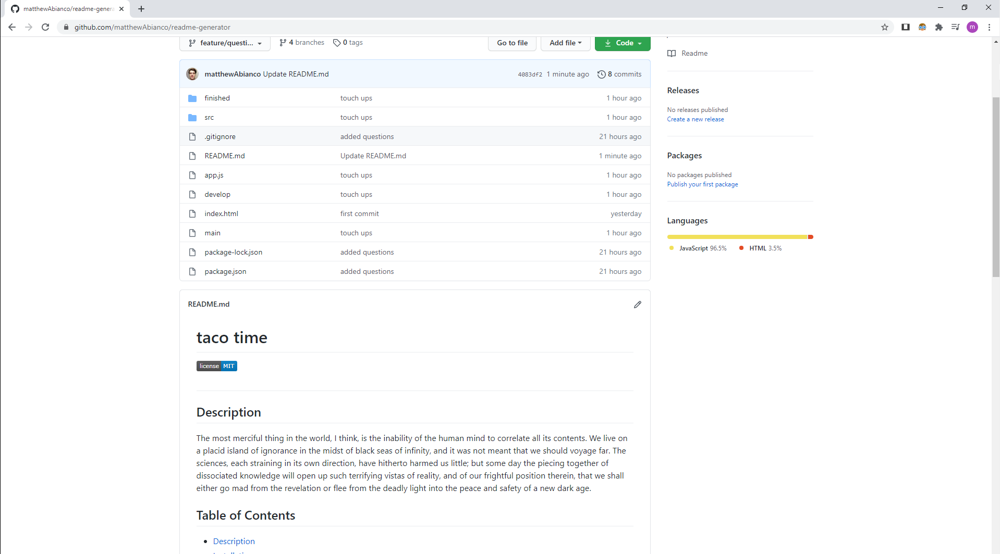

# Node.js README generator

I created a README.md template that can be run using node.js. It will ask you a series of questions that will then generate the content of the README.md file. Hopefully you find it as useful as I do! 

## Video of deployed application

https://drive.google.com/file/d/1X3EwVwdPMdGvG95eDg1WwRJGGJkZfzgB/view

## Resources used

1. Youtube
2. Visual Studio Code
4. Gitlab
5. Github
6. HTML, JavaScript
7. Node.js
---

### Contact Info

matthewbianco@protonmail.com
